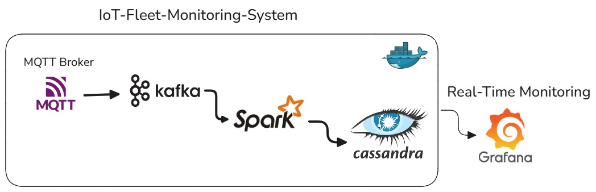
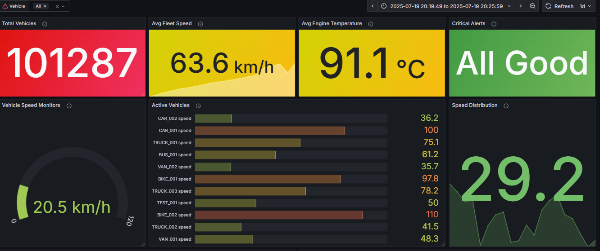
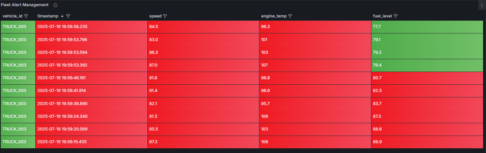
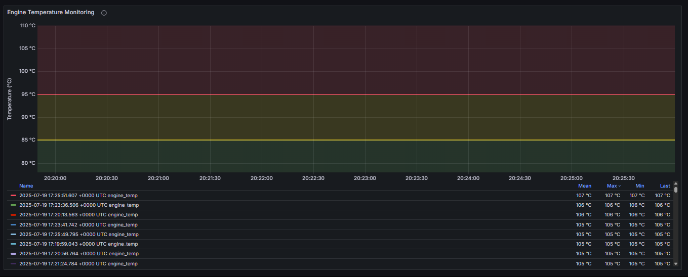

# IoT Fleet Monitoring System

A comprehensive real-time IoT fleet monitoring system that tracks vehicle telemetry, detects anomalies, Built with  MQTT, Kafka, Spark Streaming, Cassandra. 

##  Architecture Overview

 

##  Features

### Vehicle Monitoring
- **Real-time telemetry** from multiple vehicle types (trucks, vans, motorcycles)
- **GPS tracking** with route simulation
- **Engine diagnostics** including temperature and performance metrics
- **Fuel level monitoring** with consumption tracking
- **Battery voltage monitoring**

### Anomaly Detection
- **High engine temperature** alerts (>110°C)
- **Low fuel level** warnings (<10%)
- **Excessive speed** detection based on vehicle type
- **Battery voltage** anomalies
- **Real-time alert generation** with severity levels

### Data Analytics
- **Hourly aggregations** of vehicle metrics
- **Fleet-wide statistics** and summaries
- **Historical data analysis**
- **Performance trends** and insights

##  Vehicle Simulation

The system includes a realistic vehicle simulator that generates:

### Vehicle Types
- **TRUCK_001, TRUCK_002**: Heavy vehicles with lower speed limits
- **VAN_001**: Medium vehicle with balanced performance
- **BIKE_003**: Motorcycle with higher speed capabilities

### Simulated Data
- **GPS coordinates** with route progression
- **Speed variations** based on traffic patterns
- **Engine temperature** correlated with load and speed
- **Fuel consumption** based on vehicle type and usage
- **Battery voltage** with realistic fluctuations

# IoT Fleet Monitoring Dashboard

### Overview Dashboard

The main dashboard shows key fleet metrics including:
- Total number of vehicles in operation
- Average fleet speed (63.6 km/h)
- Average engine temperature (91.1°C)
- Critical alerts status
- Individual vehicle speed monitors
- Active vehicles with current speeds
- Speed distribution trends

### Fleet Alert Management

Real-time alert monitoring showing:
- Vehicle IDs
- Timestamps
- Current speed
- Engine temperature
- Fuel levels
- Critical thresholds for speed (>80 km/h), temperature (>100°C), and fuel (<20%)

### Engine Temperature Monitoring

Detailed temperature tracking featuring:
- Temperature trends over time
- Multiple vehicle temperature comparisons
- Temperature thresholds (85°C - 110°C)
- Mean, Max, Min temperature readings
- Historical temperature data

## Features
- Real-time vehicle tracking
- Speed monitoring
- Engine temperature analysis
- Fuel level tracking
- Alert management
- Historical data analysis

