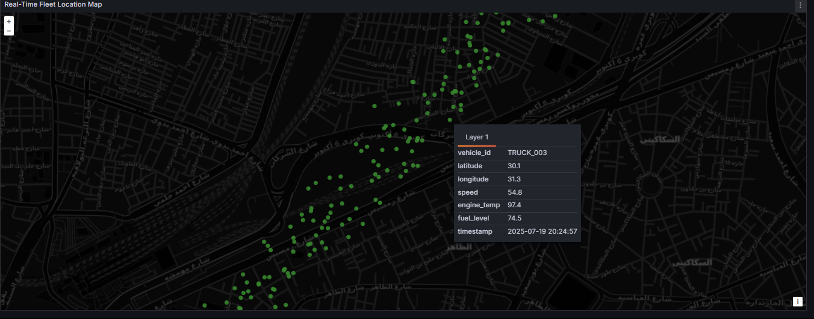

# IoT Fleet Monitoring System

A comprehensive real-time IoT fleet monitoring system that tracks vehicle telemetry, detects anomalies, Built with  MQTT, Kafka, Spark Streaming, Cassandra. 

##  Architecture Overview

 
The system follows a modern data pipeline architecture:
- **Data Collection**: MQTT broker receives telemetry from vehicle simulators
- **Message Streaming**: Kafka handles high-throughput message queuing
- **Stream Processing**: Spark Streaming processes real-time data transformations
- **Data Storage**: Cassandra provides scalable, distributed storage
- **Visualization**: Grafana dashboards for real-time monitoring

## Features

### Vehicle Monitoring
- **Real-time telemetry** from multiple vehicle types (trucks, vans, motorcycles, buses, cars)
- **GPS tracking** with route simulation and position interpolation
- **Engine diagnostics** including temperature and performance metrics
- **Fuel level monitoring** with consumption tracking
- **Battery voltage monitoring** with realistic fluctuations
- **Odometer tracking** for maintenance scheduling

### Anomaly Detection
- **High engine temperature** alerts (>110°C)
- **Low fuel level** warnings (<10%)
- **Excessive speed** detection based on vehicle type
- **Battery voltage** anomalies
- **Real-time alert generation** with severity levels

### Data Analytics
- **Hourly aggregations** of vehicle metrics
- **Fleet-wide statistics** and summaries
- **Historical data analysis**
- **Performance trends** and insights

## Vehicle Fleet Simulation

The system includes a realistic vehicle simulator that generates telemetry for:

### Vehicle Types
- **TRUCK_001, TRUCK_002, TRUCK_003**: Heavy vehicles (max speed: 85-90 km/h)
- **VAN_001, VAN_002**: Medium vehicles (max speed: 95-100 km/h)
- **BUS_001**: Public transport (max speed: 70 km/h)
- **BIKE_001, BIKE_002**: Motorcycles (max speed: 120-125 km/h)
- **CAR_001, CAR_002**: Passenger cars (max speed: 110-115 km/h)

### Simulated Data Points
- **GPS coordinates** with realistic route progression
- **Speed variations** based on traffic patterns and time of day
- **Engine temperature** correlated with load, speed, and ambient conditions
- **Fuel consumption** based on vehicle type and driving patterns
- **Battery voltage** with realistic fluctuations (12.0-14.4V)
- **Odometer readings** for maintenance tracking

### Realistic Behaviors
- **Traffic simulation**: Reduced speeds during rush hours (7-9 AM, 5-7 PM)
- **Route following**: Vehicles progress along predefined GPS waypoints
- **Fuel management**: Automatic refueling when fuel drops below 15%
- **Temperature correlation**: Engine temperature increases with speed and load

# IoT Fleet Monitoring Dashboard

A real-time fleet monitoring system that tracks vehicle telemetry data using IoT sensors, Cassandra for storage, and Grafana for visualization.

### Overview Dashboard

The main dashboard shows key fleet metrics including:
- Total number of vehicles in operation
- Average fleet speed (63.6 km/h)
- Average engine temperature (91.1°C)
- Critical alerts status
- Individual vehicle speed monitors
- Active vehicles with current speeds
- Speed distribution trends

### Fleet Alert Management

Real-time alert monitoring showing:
- Vehicle IDs
- Timestamps
- Current speed
- Engine temperature
- Fuel levels
- Critical thresholds for speed (>80 km/h), temperature (>100°C), and fuel (<20%)

### Engine Temperature Monitoring

Detailed temperature tracking featuring:
- Temperature trends over time
- Multiple vehicle temperature comparisons
- Temperature thresholds (85°C - 110°C)
- Mean, Max, Min temperature readings
- Historical temperature data

### Real-Time Fleet Location Map

Interactive map visualization showing:
- Live vehicle positions with GPS coordinates
- Route tracking with point clusters
- Real-time updates for vehicle movements

## Performance & Scalability

### Throughput Capabilities
- **Target**: 100,000+ messages per hour
- **Current**: ~10 vehicles × 3600 messages/hour = 36,000 msg/h
- **Kafka Partitioning**: By vehicle_id for parallel processing
- **Cassandra**: Optimized for time-series data with clustering

### Monitoring Metrics
- Message processing rate (messages/second)
- Kafka consumer lag
- Cassandra write latency
- Spark streaming batch processing time
